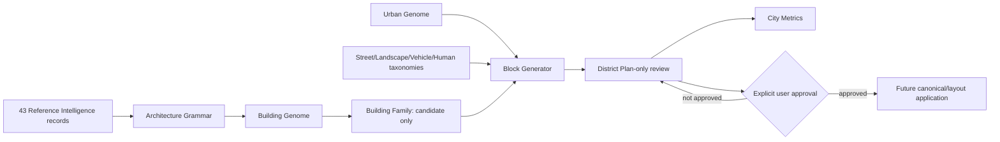

# Architecture Factory → Urban Factory → City Factory

The Factory never writes directly into the production V3 layout. Generated output stays external; Git carries schemas, generators, provenance, tests, and light reports only.

## Implementation sequence

1. Validate Reference Intelligence and Genome data contracts.
2. Build one additional plan-only district only after approval.
3. Produce a small Street Family quality pilot and presentation review.
4. Approve individual canonical candidates.
5. Apply only approved assets through a separately reviewed city-layout change.
