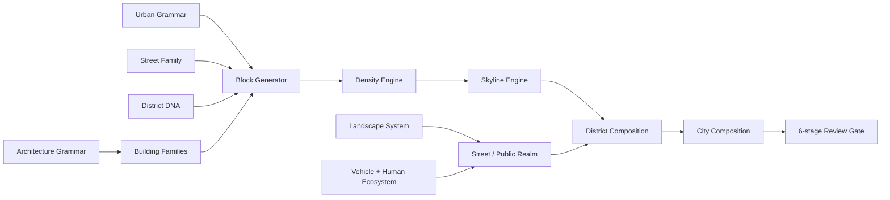

# Urban generation pipeline

```mermaid
flowchart LR
  AG[Architecture Grammar] --> BF[Building Families]
  UG[Urban Grammar] --> BG[Block Generator]
  SD[Street Family] --> BG
  DD[District DNA] --> BG
  BF --> BG
  BG --> DE[Density Engine]
  DE --> SE[Skyline Engine]
  LS[Landscape System] --> ST[Street / Public Realm]
  VE[Vehicle + Human Ecosystem] --> ST
  SE --> DI[District Composition]
  ST --> DI
  DI --> CI[City Composition]
  CI --> RG[6-stage Review Gate]
```

The skeleton produces a plan only. Later implementations may write external generated output, never repository layouts or runtime manifests.
