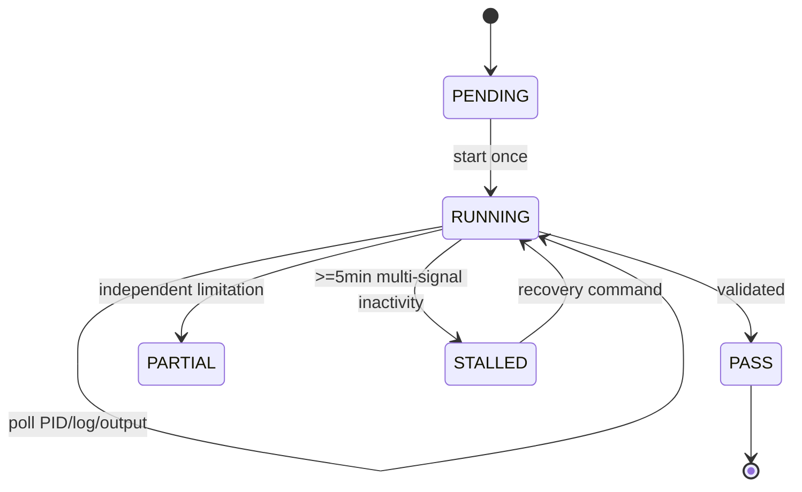

# Visual Factory Marathon V1

The factory is isolated from production: Generated output is external, all candidates are procedural-only until an explicit quality gate, and no canonical/layout/runtime operation is allowed.

## Long-run lifecycle

The runner writes atomic machine-readable checkpoints. Polling never starts a new process. Stalled is reserved for an absent child/PID and no log/output growth for at least five minutes.

## Material paths

1. **Procedural-only:** Blender nodes, no Image API, no external image references.
2. **External atlas:** deterministic provenance asset; currently technically valid but visually unapproved.
3. **Post-process:** experimental and always validator-gated.
